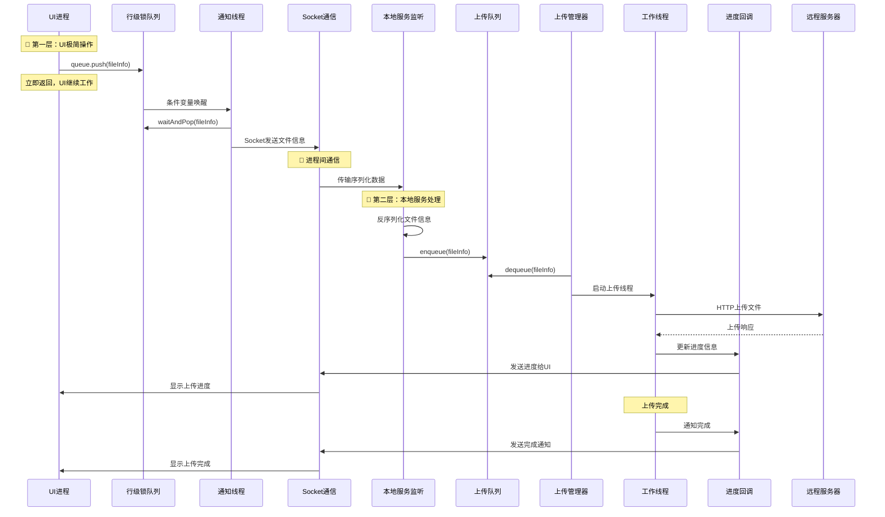

# 客户端与本地服务架构协作设计

## 📋 整体架构概览

基于client.md的极简分层设计，本文档详细描述客户端与本地服务之间的协作关系。

## 🏗️ 三层架构协作图

```
┌─────────────────────────────────────────────────────────────┐
│                   🎨 第一层：UI客户端进程                    │
│                                                             │
│  ┌─────────────┐    ┌─────────────┐    ┌─────────────┐      │
│  │   拖拽检测   │    │   按钮选择   │    │   状态显示   │      │
│  └─────────────┘    └─────────────┘    └─────────────┘      │
│           │                 │                 ▲             │
│           └─────────────────┼─────────────────┘             │
│                             ▼                               │
│         🎯 极简调用：queue.push(fileInfo) - 立即返回         │
│                             │                               │
│           ┌─────────────────▼─────────────────┐             │
│           │      🔒 ThreadSafeRowLockQueue     │             │
│           │        (行级锁队列)                │             │
│           └─────────────────┬─────────────────┘             │
│                             │                               │
│           ┌─────────────────▼─────────────────┐             │
│           │       🧵 通知线程独立工作          │             │
│           │    条件变量唤醒 → Socket发送       │             │
│           └─────────────────┬─────────────────┘             │
├─────────────────────────────┼─────────────────────────────────┤
│                             ▼                               │
│                    Socket IPC 通信                         │
├─────────────────────────────┼─────────────────────────────────┤
│                             ▼                               │
│                🏢 第二层：本地服务进程                       │
│                                                             │
│  ┌─────────────────────────────────────────────────────────┐ │
│  │              🔌 Socket监听线程                          │ │
│  │          接收通知 → 反序列化 → 入队                     │ │
│  └─────────────────────┬───────────────────────────────────┘ │
│                        ▼                                   │
│  ┌─────────────────────────────────────────────────────────┐ │
│  │              📊 全局上传队列                            │ │
│  │          线程安全缓冲区，支持高并发                     │ │
│  └─────────────────────┬───────────────────────────────────┘ │
│                        ▼                                   │
│  ┌─────────────────────────────────────────────────────────┐ │
│  │              🎛️ 上传管理线程                           │ │
│  │       读取队列 + 维护线程引用计数                       │ │
│  └─────────────────────┬───────────────────────────────────┘ │
│                        ▼                                   │
│  ┌─────────────────────────────────────────────────────────┐ │
│  │            🧵 上传工作线程池                            │ │
│  │     可配置并发数，执行真实HTTP上传                      │ │
│  └─────────────────────┬───────────────────────────────────┘ │
│                        ▼                                   │
│  ┌─────────────────────────────────────────────────────────┐ │
│  │            📞 进度回调线程                              │ │
│  │      每秒收集进度 → Socket发送给UI                      │ │
│  └─────────────────────┬───────────────────────────────────┘ │
├─────────────────────────┼─────────────────────────────────────┤
│                         ▼                                   │
│                   Socket 进度回调                           │
├─────────────────────────┼─────────────────────────────────────┤
│                         ▼                                   │
│               🌐 第三层：远程服务器                          │
│                                                             │
│            HTTP上传 → 文件存储 → 响应确认                   │
└─────────────────────────────────────────────────────────────┘
```

## 🔄 详细交互时序

### 1. 文件上传完整流程



### 2. 核心设计对比

| 层级 | 组件 | 职责 | 技术实现 | 性能特点 |
|------|------|------|----------|----------|
| **第一层** | UI进程 | 文件检测 + 入队 | Qt + ThreadSafeRowLockQueue | 零延迟响应 |
| **第一层** | 通知线程 | 队列处理 + Socket通知 | std::thread + 条件变量 | 精确唤醒 |
| **第二层** | Socket监听 | IPC接收 + 反序列化 | Socket + JSON/Binary | 高吞吐量 |
| **第二层** | 上传管理 | 线程调度 + 队列管理 | 线程池管理 | 动态调度 |
| **第二层** | 工作线程 | HTTP上传执行 | HTTP库 + 分片上传 | 高并发 |
| **第二层** | 进度回调 | 状态收集 + UI反馈 | 定时器 + Socket | 实时反馈 |

## 🎯 职责分离原则验证

### UI进程职责（极简化）
```cpp
✅ 应该做：
- 检测文件拖拽/选择
- 调用 queue.push(fileInfo)
- 显示进度回调（可选）
- 立即返回，继续响应用户

❌ 不应该做：
- 管理上传逻辑
- 处理网络连接
- 维护上传状态
- 执行文件传输
```

### 本地服务职责（重活干活）
```cpp
✅ 应该做：
- 接收客户端通知
- 管理上传队列
- 调度上传线程
- 执行HTTP上传
- 进度状态回调
- 错误处理重试

❌ 不应该做：
- 处理UI交互
- 管理界面显示
- 用户操作响应
```

## 📊 性能设计要点

### 1. UI进程性能优化
```cpp
🎯 零延迟设计：
- queue.push() 操作 < 1ms
- 行级锁避免UI阻塞
- 立即返回策略
- 条件变量精确唤醒

📈 内存效率：
- 队列中只存储文件信息，不存储文件内容
- 智能指针管理内存
- 避免不必要的数据拷贝
```

### 2. 本地服务性能优化
```cpp
🧵 多线程并发：
- 可配置并发上传数（默认4线程）
- 线程池动态管理
- 异常线程自动重启
- 负载均衡调度

📡 网络优化：
- 分片上传支持
- 断点续传机制
- 自动重试策略
- 连接池复用
```

## 🔌 Socket通信协议设计

### 1. 客户端 → 本地服务
```json
{
    "type": "upload_request",
    "timestamp": "2025-06-22T10:30:00Z",
    "file_info": {
        "file_path": "C:/Users/Documents/report.pdf",
        "file_size": 1048576,
        "file_md5": "d41d8cd98f00b204e9800998ecf8427e",
        "upload_id": "uuid-12345"
    }
}
```

### 2. 本地服务 → UI进程
```json
{
    "type": "progress_update", 
    "timestamp": "2025-06-22T10:30:15Z",
    "upload_id": "uuid-12345",
    "progress": {
        "percentage": 45,
        "speed_mbps": 2.5,
        "status": "uploading",
        "eta_seconds": 120
    }
}
```

## 🛡️ 错误处理和恢复机制

### 1. UI进程错误处理
```cpp
try {
    // 文件验证
    if (!fileExists(filePath)) {
        showError("文件不存在");
        return;
    }
    
    // 极简调用
    Lusp_SyncUploadQueue::instance().push(filePath);
    
} catch (const std::exception& e) {
    showError("提交失败: " + e.what());
}
```

### 2. 本地服务错误处理
```cpp
// Socket监听异常恢复
if (socketError) {
    restartSocketListener();
}

// 上传线程异常恢复  
if (uploadThreadCrash) {
    startNewUploadThread();
}

// 网络异常重试
if (networkError) {
    retryWithBackoff();
}
```

## 🎉 架构优势总结

### 🎯 用户体验优势
1. **零延迟响应**: UI操作立即返回，用户感觉流畅
2. **实时进度**: 每秒进度更新，状态清晰可见
3. **稳定可靠**: 进程隔离，上传服务崩溃不影响UI
4. **易于使用**: 拖拽即上传，操作简单直观

### 🏗️ 架构设计优势
1. **职责分离**: UI和上传完全解耦，易于维护
2. **高性能**: 行级锁队列 + 多线程并发
3. **可扩展**: 支持配置调整，易于功能扩展
4. **标准实现**: 基于标准C++，跨平台兼容

### 🔧 开发维护优势
1. **代码简洁**: UI层只需要一个接口调用
2. **测试友好**: 各组件独立，便于单元测试
3. **部署灵活**: 客户端和服务可独立部署
4. **监控完善**: 支持状态查询和性能监控

## 🚀 总结

这个三层架构设计完美实现了：

- **🎨 UI极简**: 只需`queue.push()`，用户体验极佳
- **🏢 服务强大**: 本地服务承担所有重活，性能优异  
- **📞 通信高效**: Socket IPC，协议清晰，实时反馈
- **🛡️ 稳定可靠**: 进程隔离，异常恢复，长期运行

这是一个真正的**生产级高性能文件上传系统架构**！
