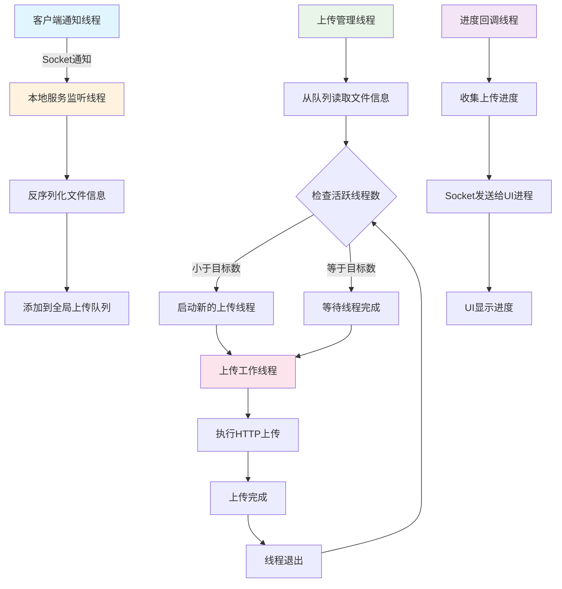

# 高性能本地上传服务架构设计

## 📋 核心设计理念

### 基于分层架构的本地服务设计
本地上传服务采用**高并发多线程**的设计理念，作为客户端和远程服务器之间的核心桥梁：

```
客户端通知线程
    ↓ Socket通知（文件路径+文件信息）
本地服务监听线程 → 反序列化数据 → 添加到上传队列
    ↓
上传管理线程 (核心调度)
    ↓ 1️⃣ 读取上传队列中的文件信息
    ↓ 2️⃣ 维护上传线程引用计数，保证目标并发数
上传工作线程池 (可配置并发数)
    ↓ 执行真实的HTTP上传
远程服务器接收
    ↓
进度回调线程 → 每秒回调进度 → Socket发送给UI进程
```

**🎯 核心设计原则：**
- 🏢 **本地服务独立**：独立进程运行，不影响UI响应
- 🔌 **Socket通信**：与客户端通过Socket进行IPC通信
- 🧵 **多线程并发**：上传线程池支持可配置并发上传
- 📊 **队列管理**：全局上传队列，支持高并发入队出队
- ⏱️ **实时进度**：专门的进度回调线程，定时反馈状态
- 🎛️ **线程池管理**：动态维护目标数量的上传线程
- 🛡️ **错误恢复**：上传失败自动重试，线程异常自动重启

## 🏗️ 本地服务架构设计

### 1. 整体架构图

```
┌─────────────────────────────────────────────────────────────┐
│                🏢 本地上传服务进程                           │
├─────────────────────────────────────────────────────────────┤
│           🔌 Socket监听线程 (IPC通信层)                      │
│  • 监听客户端通知                                           │
│  • 反序列化文件信息数据结构                                  │
│  • 添加到全局上传队列                                       │
├─────────────────────────────────────────────────────────────┤
│            📊 上传队列管理 (数据缓冲层)                      │
│  • 全局线程安全上传队列                                     │
│  • 支持高并发入队出队                                       │
│  • 队列状态监控                                            │
├─────────────────────────────────────────────────────────────┤
│           🎛️ 上传管理线程 (核心调度层)                       │
│  • 从队列读取文件信息                                       │
│  • 维护上传线程引用计数                                     │
│  • 保证目标数量的活跃上传线程                               │
│  • 线程异常检测和恢复                                       │
├─────────────────────────────────────────────────────────────┤
│          🧵 上传工作线程池 (执行层)                          │
│  • 可配置并发数 (默认4个线程)                               │
│  • 执行真实的HTTP文件上传                                   │
│  • 支持断点续传和重试机制                                   │
│  • 上传完成后自动启动新的上传任务                           │
├─────────────────────────────────────────────────────────────┤
│           📞 进度回调线程 (状态反馈层)                        │
│  • 每秒收集所有上传线程的进度                               │
│  • Socket发送进度信息给UI进程                               │
│  • 支持上传状态、速度、错误信息回调                         │
└─────────────────────────────────────────────────────────────┘
```

### 2. 核心交互流程



## 🔧 核心组件设计

### 1. Socket监听线程 - IPC通信接收器

**📌 设计理念**：专门负责接收客户端通知，快速反序列化并入队


### 2. 全局上传队列 - 高并发数据缓冲

**📌 设计理念**：线程安全的队列，支持高并发入队出队


### 3. 上传管理线程 - 核心调度器

**📌 设计理念**：维护目标数量的上传线程，动态调度和监控


### 4. 上传工作线程 - 实际执行者

**📌 设计理念**：执行真实的HTTP上传，支持断点续传和重试


### 5. 进度回调线程 - 状态反馈管理器

**📌 设计理念**：收集所有上传进度，定时反馈给UI进程


## 📊 本地服务配置和启动

### 1. 服务配置文件

**配置文件示例 (localserver.config)**：
```json
{
    "service": {
        "name": "HighPerformanceUploadService",
        "version": "1.0.0",
        "debug_mode": false
    },
    "network": {
        "client_listen_port": 8901,
        "ui_callback_port": 8902,
        "remote_server_url": "https://upload.example.com/api/upload"
    },
    "upload": {
        "max_concurrent_threads": 4,
        "chunk_size_mb": 1,
        "retry_count": 3,
        "timeout_seconds": 30
    },
    "queue": {
        "max_queue_size": 1000,
        "queue_check_interval_ms": 100
    }
}
```

### 2. 服务启动和管理


## 🔄 服务间通信协议

### 1. 客户端 → 本地服务通信

**上传通知消息格式**：
protofbuf

### 2. 本地服务 → UI进程通信

protobuf

**完成通知消息格式**：
protobuf

## 🎯 总结

### 本地服务核心优势

1. **🏢 独立进程运行**: 不影响UI响应，稳定可靠
2. **🧵 多线程并发**: 可配置并发数，最大化上传效率
3. **📊 队列缓冲**: 支持高并发文件入队，平滑处理突发请求
4. **🔄 动态调度**: 智能管理上传线程，自动恢复异常线程
5. **📞 实时反馈**: 每秒精确回调进度，UI体验流畅
6. **🛡️ 错误恢复**: 支持断点续传、自动重试、异常处理

### 架构设计亮点

- **职责分离清晰**: 监听、队列、调度、执行、回调各司其职
- **高并发性能**: 多线程设计，支持大量文件同时上传
- **可扩展架构**: 支持配置调整，易于功能扩展
- **IPC通信**: Socket方式与客户端解耦，协议清晰
- **生产级稳定**: 异常处理完善，支持长期运行

这个本地服务设计完美承接了客户端的极简架构，提供了强大的后台上传能力，是整个高性能文件上传系统的核心组件！

## 🛡️ Windows服务（守护进程）实现

### Windows服务架构设计

本地上传服务支持以**Windows服务**方式运行，提供无人值守的后台上传能力：

```
┌─────────────────────────────────────────────────────────────┐
│                 🏢 Windows服务容器                          │
├─────────────────────────────────────────────────────────────┤
│           🎛️ 服务控制管理器 (SCM接口)                        │
│  • 服务启动/停止/暂停/恢复                                   │
│  • 服务状态报告                                             │
│  • 服务依赖管理                                             │
├─────────────────────────────────────────────────────────────┤
│            🔧 服务主控制线程                                │
│  • 接收SCM控制指令                                          │
│  • 管理服务生命周期                                         │
│  • 协调内部组件启停                                         │
├─────────────────────────────────────────────────────────────┤
│          📊 本地上传服务核心 (嵌入式)                        │
│  • Socket监听线程                                           │
│  • 上传队列管理                                             │
│  • 上传管理线程                                             │
│  • 上传工作线程池                                           │
│  • 进度回调线程                                             │
├─────────────────────────────────────────────────────────────┤
│           📝 服务日志和监控                                  │
│  • Windows事件日志集成                                      │
│  • 文件日志记录                                             │
│  • 性能计数器                                               │
│  • 健康状态监控                                             │
└─────────────────────────────────────────────────────────────┘
```

### 1. Windows服务主程序实现

**服务主入口点**：
```cpp
// 🛡️ Windows服务主程序 - 服务入口点
#include <windows.h>
#include <winsvc.h>
#include <tchar.h>
#include <strsafe.h>

// 服务名称和显示名称
#define SERVICE_NAME        TEXT("HighPerformanceUploadService")
#define SERVICE_DISPLAY_NAME TEXT("高性能文件上传服务")
#define SERVICE_DESCRIPTION  TEXT("提供高并发文件上传功能的后台服务")

// 全局变量
SERVICE_STATUS gServiceStatus = {0};
SERVICE_STATUS_HANDLE gStatusHandle = NULL;
HANDLE gServiceStopEvent = INVALID_HANDLE_VALUE;

// 本地上传服务实例
std::unique_ptr<LocalUploadService> gUploadService;

// 🎯 服务主入口点
int _tmain(int argc, TCHAR* argv[]) {
    // 检查命令行参数
    if (argc > 1) {
        if (_tcscmp(argv[1], TEXT("install")) == 0) {
            return InstallService();
        } else if (_tcscmp(argv[1], TEXT("uninstall")) == 0) {
            return UninstallService();
        } else if (_tcscmp(argv[1], TEXT("console")) == 0) {
            // 控制台模式运行（调试用）
            return RunAsConsole();
        }
    }
    
    // 默认以服务模式启动
    SERVICE_TABLE_ENTRY serviceTable[] = {
        {SERVICE_NAME, (LPSERVICE_MAIN_FUNCTION)ServiceMain},
        {NULL, NULL}
    };
    
    if (StartServiceCtrlDispatcher(serviceTable) == FALSE) {
        LogError(TEXT("StartServiceCtrlDispatcher failed"));
        return GetLastError();
    }
    
    return 0;
}

// 🎛️ 服务主函数 - SCM调用入口
VOID WINAPI ServiceMain(DWORD argc, LPTSTR* argv) {
    DWORD status = E_FAIL;
    
    // 注册服务控制处理程序
    gStatusHandle = RegisterServiceCtrlHandler(SERVICE_NAME, ServiceCtrlHandler);
    
    if (gStatusHandle == NULL) {
        LogError(TEXT("RegisterServiceCtrlHandler failed"));
        goto cleanup;
    }
    
    // 初始化服务状态
    ZeroMemory(&gServiceStatus, sizeof(gServiceStatus));
    gServiceStatus.dwServiceType = SERVICE_WIN32_OWN_PROCESS;
    gServiceStatus.dwControlsAccepted = 0;
    gServiceStatus.dwCurrentState = SERVICE_START_PENDING;
    gServiceStatus.dwWin32ExitCode = 0;
    gServiceStatus.dwServiceSpecificExitCode = 0;
    gServiceStatus.dwCheckPoint = 0;
    
    // 报告服务状态
    if (SetServiceStatus(gStatusHandle, &gServiceStatus) == FALSE) {
        LogError(TEXT("SetServiceStatus failed"));
    }
    
    // 创建服务停止事件
    gServiceStopEvent = CreateEvent(NULL, TRUE, FALSE, NULL);
    if (gServiceStopEvent == NULL) {
        gServiceStatus.dwControlsAccepted = 0;
        gServiceStatus.dwCurrentState = SERVICE_STOPPED;
        gServiceStatus.dwWin32ExitCode = GetLastError();
        gServiceStatus.dwCheckPoint = 1;
        
        SetServiceStatus(gStatusHandle, &gServiceStatus);
        goto cleanup;
    }
    
    // 服务启动逻辑
    gServiceStatus.dwControlsAccepted = SERVICE_ACCEPT_STOP;
    gServiceStatus.dwCurrentState = SERVICE_RUNNING;
    gServiceStatus.dwWin32ExitCode = 0;
    gServiceStatus.dwCheckPoint = 0;
    
    if (SetServiceStatus(gStatusHandle, &gServiceStatus) == FALSE) {
        LogError(TEXT("SetServiceStatus failed"));
    }
    
    // 🚀 启动本地上传服务核心
    if (StartUploadService() == FALSE) {
        LogError(TEXT("Failed to start upload service"));
        goto cleanup;
    }
    
    LogInfo(TEXT("高性能上传服务已启动"));
    
    // 等待服务停止信号
    WaitForSingleObject(gServiceStopEvent, INFINITE);
    
    // 🛑 停止本地上传服务核心
    StopUploadService();
    LogInfo(TEXT("高性能上传服务已停止"));
    
cleanup:
    CloseHandle(gServiceStopEvent);
    
    gServiceStatus.dwControlsAccepted = 0;
    gServiceStatus.dwCurrentState = SERVICE_STOPPED;
    gServiceStatus.dwWin32ExitCode = 0;
    gServiceStatus.dwCheckPoint = 3;
    
    SetServiceStatus(gStatusHandle, &gServiceStatus);
}

// 🎛️ 服务控制处理程序
VOID WINAPI ServiceCtrlHandler(DWORD ctrlCode) {
    switch (ctrlCode) {
        case SERVICE_CONTROL_STOP:
            LogInfo(TEXT("收到服务停止请求"));
            
            if (gServiceStatus.dwCurrentState != SERVICE_RUNNING)
                break;
            
            gServiceStatus.dwControlsAccepted = 0;
            gServiceStatus.dwCurrentState = SERVICE_STOP_PENDING;
            gServiceStatus.dwWin32ExitCode = 0;
            gServiceStatus.dwCheckPoint = 4;
            
            SetServiceStatus(gStatusHandle, &gServiceStatus);
            
            // 触发服务停止事件
            SetEvent(gServiceStopEvent);
            break;
            
        default:
            break;
    }
}
```

### 2. 服务核心集成

**与现有多线程架构集成**：
```cpp
// 🚀 启动上传服务核心 - 与现有架构集成
BOOL StartUploadService() {
    try {
        // 创建本地上传服务实例
        gUploadService = std::make_unique<LocalUploadService>();
        
        // 设置服务模式（非控制台模式）
        gUploadService->setServiceMode(true);
        
        // 启动服务（异步启动，不阻塞服务线程）
        std::thread serviceThread([&]() {
            try {
                gUploadService->start();
            } catch (const std::exception& e) {
                LogError((TEXT("服务启动失败: ") + std::wstring(e.what(), e.what() + strlen(e.what()))).c_str());
            }
        });
        serviceThread.detach();
        
        // 等待服务组件完全启动
        if (!gUploadService->waitForStartup(10000)) {  // 10秒超时
            LogError(TEXT("服务启动超时"));
            return FALSE;
        }
        
        LogInfo(TEXT("上传服务核心启动成功"));
        return TRUE;
        
    } catch (const std::exception& e) {
        LogError((TEXT("创建服务实例失败: ") + std::wstring(e.what(), e.what() + strlen(e.what()))).c_str());
        return FALSE;
    }
}

// 🛑 停止上传服务核心
VOID StopUploadService() {
    if (gUploadService) {
        try {
            LogInfo(TEXT("正在停止上传服务核心..."));
            gUploadService->stop();
            
            // 等待所有组件完全停止
            if (!gUploadService->waitForShutdown(15000)) {  // 15秒超时
                LogWarning(TEXT("服务停止超时，强制终止"));
            }
            
            gUploadService.reset();
            LogInfo(TEXT("上传服务核心已停止"));
            
        } catch (const std::exception& e) {
            LogError((TEXT("停止服务时发生错误: ") + std::wstring(e.what(), e.what() + strlen(e.what()))).c_str());
        }
    }
}
```

### 3. 服务安装和管理

**服务安装程序**：
```cpp
// 📦 服务安装程序
DWORD InstallService() {
    SC_HANDLE schSCManager;
    SC_HANDLE schService;
    TCHAR szPath[MAX_PATH];
    
    // 获取当前可执行文件路径
    if (!GetModuleFileName(NULL, szPath, MAX_PATH)) {
        _tprintf(TEXT("Cannot install service (%d)\n"), GetLastError());
        return GetLastError();
    }
    
    // 打开服务控制管理器
    schSCManager = OpenSCManager(
        NULL,                    // 本地计算机
        NULL,                    // ServicesActive数据库
        SC_MANAGER_ALL_ACCESS);  // 完全访问权限
    
    if (NULL == schSCManager) {
        _tprintf(TEXT("OpenSCManager failed (%d)\n"), GetLastError());
        return GetLastError();
    }
    
    // 创建服务
    schService = CreateService(
        schSCManager,              // SCM数据库句柄
        SERVICE_NAME,              // 服务名称
        SERVICE_DISPLAY_NAME,      // 服务显示名称
        SERVICE_ALL_ACCESS,        // 期望的访问权限
        SERVICE_WIN32_OWN_PROCESS, // 服务类型
        SERVICE_AUTO_START,        // 启动类型（自动启动）
        SERVICE_ERROR_NORMAL,      // 错误控制类型
        szPath,                    // 可执行文件路径
        NULL,                      // 无加载顺序组
        NULL,                      // 无标记标识符
        NULL,                      // 无依赖关系
        NULL,                      // LocalSystem账户
        NULL);                     // 无密码
    
    if (schService == NULL) {
        DWORD dwError = GetLastError();
        if (dwError == ERROR_SERVICE_EXISTS) {
            _tprintf(TEXT("Service already exists.\n"));
        } else {
            _tprintf(TEXT("CreateService failed (%d)\n"), dwError);
        }
        CloseServiceHandle(schSCManager);
        return dwError;
    }
    
    // 设置服务描述
    SERVICE_DESCRIPTION sd;
    sd.lpDescription = SERVICE_DESCRIPTION;
    ChangeServiceConfig2(schService, SERVICE_CONFIG_DESCRIPTION, &sd);
    
    _tprintf(TEXT("Service installed successfully\n"));
    
    CloseServiceHandle(schService);
    CloseServiceHandle(schSCManager);
    return 0;
}

// 🗑️ 服务卸载程序
DWORD UninstallService() {
    SC_HANDLE schSCManager;
    SC_HANDLE schService;
    SERVICE_STATUS ssStatus;
    
    // 打开服务控制管理器
    schSCManager = OpenSCManager(NULL, NULL, SC_MANAGER_ALL_ACCESS);
    
    if (NULL == schSCManager) {
        _tprintf(TEXT("OpenSCManager failed (%d)\n"), GetLastError());
        return GetLastError();
    }
    
    // 打开服务
    schService = OpenService(schSCManager, SERVICE_NAME, SERVICE_ALL_ACCESS);
    
    if (schService == NULL) {
        _tprintf(TEXT("OpenService failed (%d)\n"), GetLastError());
        CloseServiceHandle(schSCManager);
        return GetLastError();
    }
    
    // 尝试停止服务
    if (ControlService(schService, SERVICE_CONTROL_STOP, &ssStatus)) {
        _tprintf(TEXT("Stopping service"));
        Sleep(1000);
        
        while (QueryServiceStatus(schService, &ssStatus)) {
            if (ssStatus.dwCurrentState == SERVICE_STOP_PENDING) {
                _tprintf(TEXT("."));
                Sleep(1000);
            } else break;
        }
        
        if (ssStatus.dwCurrentState == SERVICE_STOPPED) {
            _tprintf(TEXT("\nService stopped successfully\n"));
        } else {
            _tprintf(TEXT("\nService failed to stop\n"));
        }
    }
    
    // 删除服务
    if (!DeleteService(schService)) {
        _tprintf(TEXT("DeleteService failed (%d)\n"), GetLastError());
    } else {
        _tprintf(TEXT("Service uninstalled successfully\n"));
    }
    
    CloseServiceHandle(schService);
    CloseServiceHandle(schSCManager);
    return 0;
}
```

### 4. 服务监控和日志

**Windows事件日志集成**：
```cpp
// 📝 Windows事件日志管理器
class WindowsEventLogger {
private:
    HANDLE hEventSource;
    
public:
    WindowsEventLogger() {
        // 注册事件源
        hEventSource = RegisterEventSource(NULL, SERVICE_NAME);
    }
    
    ~WindowsEventLogger() {
        if (hEventSource) {
            DeregisterEventSource(hEventSource);
        }
    }
    
    void LogInfo(LPCTSTR message) {
        LogEvent(EVENTLOG_INFORMATION_TYPE, message);
    }
    
    void LogWarning(LPCTSTR message) {
        LogEvent(EVENTLOG_WARNING_TYPE, message);
    }
    
    void LogError(LPCTSTR message) {
        LogEvent(EVENTLOG_ERROR_TYPE, message);
    }
    
private:
    void LogEvent(WORD eventType, LPCTSTR message) {
        if (hEventSource) {
            LPCTSTR strings[1] = {message};
            
            ReportEvent(hEventSource,        // 事件日志句柄
                       eventType,            // 事件类型
                       0,                    // 事件类别
                       0,                    // 事件标识符
                       NULL,                 // 无安全标识符
                       1,                    // 字符串数量
                       0,                    // 无原始数据
                       strings,              // 字符串数组
                       NULL);                // 无原始数据
        }
    }
};

// 全局日志实例
std::unique_ptr<WindowsEventLogger> gEventLogger;

// 🎯 日志辅助函数
void LogInfo(LPCTSTR message) {
    if (!gEventLogger) gEventLogger = std::make_unique<WindowsEventLogger>();
    gEventLogger->LogInfo(message);
    
    // 同时输出到文件日志
    WriteToFileLog(TEXT("INFO"), message);
}

void LogWarning(LPCTSTR message) {
    if (!gEventLogger) gEventLogger = std::make_unique<WindowsEventLogger>();
    gEventLogger->LogWarning(message);
    WriteToFileLog(TEXT("WARNING"), message);
}

void LogError(LPCTSTR message) {
    if (!gEventLogger) gEventLogger = std::make_unique<WindowsEventLogger>();
    gEventLogger->LogError(message);
    WriteToFileLog(TEXT("ERROR"), message);
}

// 📄 文件日志记录
void WriteToFileLog(LPCTSTR level, LPCTSTR message) {
    TCHAR logPath[MAX_PATH];
    GetModuleFileName(NULL, logPath, MAX_PATH);
    PathRemoveFileSpec(logPath);
    PathAppend(logPath, TEXT("UploadService.log"));
    
    FILE* logFile = _tfopen(logPath, TEXT("a"));
    if (logFile) {
        SYSTEMTIME st;
        GetLocalTime(&st);
        
        _ftprintf(logFile, TEXT("[%04d-%02d-%02d %02d:%02d:%02d] [%s] %s\n"),
                 st.wYear, st.wMonth, st.wDay,
                 st.wHour, st.wMinute, st.wSecond,
                 level, message);
        
        fclose(logFile);
    }
}
```

### 5. 调试和管理工具

**控制台模式支持**：
```cpp
// 🖥️ 控制台模式运行（调试用）
int RunAsConsole() {
    _tprintf(TEXT("====================================\n"));
    _tprintf(TEXT("高性能文件上传服务 - 控制台模式\n"));
    _tprintf(TEXT("====================================\n"));
    
    // 初始化控制台日志
    SetConsoleTitle(TEXT("高性能文件上传服务"));
    
    try {
        // 创建并启动服务
        LocalUploadService service;
        service.setServiceMode(false);  // 控制台模式
        
        _tprintf(TEXT("正在启动服务...\n"));
        service.start();
        
        _tprintf(TEXT("服务已启动，按 Ctrl+C 停止服务\n"));
        _tprintf(TEXT("------------------------------------\n"));
        
        // 等待用户中断
        while (true) {
            std::this_thread::sleep_for(std::chrono::seconds(1));
        }
        
    } catch (const std::exception& e) {
        _tprintf(TEXT("服务启动失败: %hs\n"), e.what());
        return 1;
    }
    
    return 0;
}

// 💻 服务管理命令行工具
void PrintUsage() {
    _tprintf(TEXT("用法:\n"));
    _tprintf(TEXT("  %s install          - 安装Windows服务\n"), SERVICE_NAME);
    _tprintf(TEXT("  %s uninstall        - 卸载Windows服务\n"), SERVICE_NAME);
    _tprintf(TEXT("  %s console          - 控制台模式运行\n"), SERVICE_NAME);
    _tprintf(TEXT("  %s                  - 服务模式运行\n"), SERVICE_NAME);
    _tprintf(TEXT("\n"));
    _tprintf(TEXT("服务管理:\n"));
    _tprintf(TEXT("  net start %s        - 启动服务\n"), SERVICE_NAME);
    _tprintf(TEXT("  net stop %s         - 停止服务\n"), SERVICE_NAME);
    _tprintf(TEXT("  sc query %s         - 查询服务状态\n"), SERVICE_NAME);
}
```

### 6. 服务配置增强

**服务专用配置**：
```json
{
    "service": {
        "name": "HighPerformanceUploadService",
        "display_name": "高性能文件上传服务",
        "description": "提供高并发文件上传功能的后台服务",
        "start_type": "auto",
        "service_mode": true,
        "debug_mode": false
    },
    "logging": {
        "enable_event_log": true,
        "enable_file_log": true,
        "log_level": "info",
        "max_log_size_mb": 100,
        "log_rotation_days": 30
    },
    "monitoring": {
        "enable_performance_counters": true,
        "health_check_interval_seconds": 60,
        "auto_restart_on_failure": true,
        "max_restart_attempts": 3
    },
    "network": {
        "client_listen_port": 8901,
        "ui_callback_port": 8902,
        "remote_server_url": "https://upload.example.com/api/upload",
        "bind_to_localhost_only": true
    },
    "upload": {
        "max_concurrent_threads": 4,
        "chunk_size_mb": 1,
        "retry_count": 3,
        "timeout_seconds": 30,
        "enable_resume": true
    }
}
```

## 🛠️ Windows服务部署和管理

### 部署步骤

1. **编译服务程序**：
   ```cmd
   # 编译为Windows服务可执行文件
   cl /EHsc /MT UploadService.cpp /link ws2_32.lib advapi32.lib shell32.lib
   ```

2. **安装服务**：
   ```cmd
   # 以管理员权限运行
   UploadService.exe install
   ```

3. **启动服务**：
   ```cmd
   # 方式1：使用net命令
   net start HighPerformanceUploadService
   
   # 方式2：使用sc命令
   sc start HighPerformanceUploadService
   
   # 方式3：使用服务管理器GUI
   services.msc
   ```

4. **服务管理**：
   ```cmd
   # 查询服务状态
   sc query HighPerformanceUploadService
   
   # 停止服务
   net stop HighPerformanceUploadService
   
   # 卸载服务
   UploadService.exe uninstall
   ```

### Windows服务优势

1. **🔄 自动启动**：系统启动时自动运行，无需用户登录
2. **🛡️ 后台运行**：不占用桌面，不受用户会话影响
3. **⚡ 高权限运行**：以系统账户运行，访问权限更高
4. **📊 系统集成**：集成Windows事件日志和服务管理器
5. **🔒 安全隔离**：独立进程空间，安全性更好
6. **💪 稳定可靠**：支持自动重启、依赖管理等企业级特性

### 与现有架构的完美融合

Windows服务设计完美保留了现有的多线程架构：
- **Socket监听线程**：继续监听客户端连接
- **上传队列管理**：保持高并发队列机制
- **上传管理线程**：维持动态线程池调度
- **上传工作线程池**：执行实际的HTTP上传
- **进度回调线程**：实时反馈上传状态

只是在外层包装了Windows服务框架，提供了更强大的系统级运行能力！
