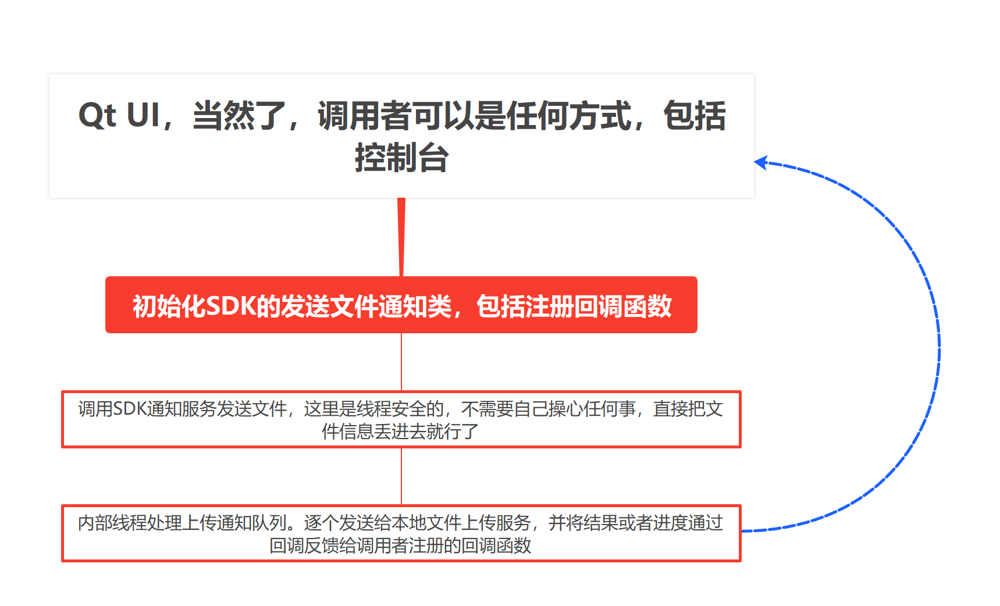
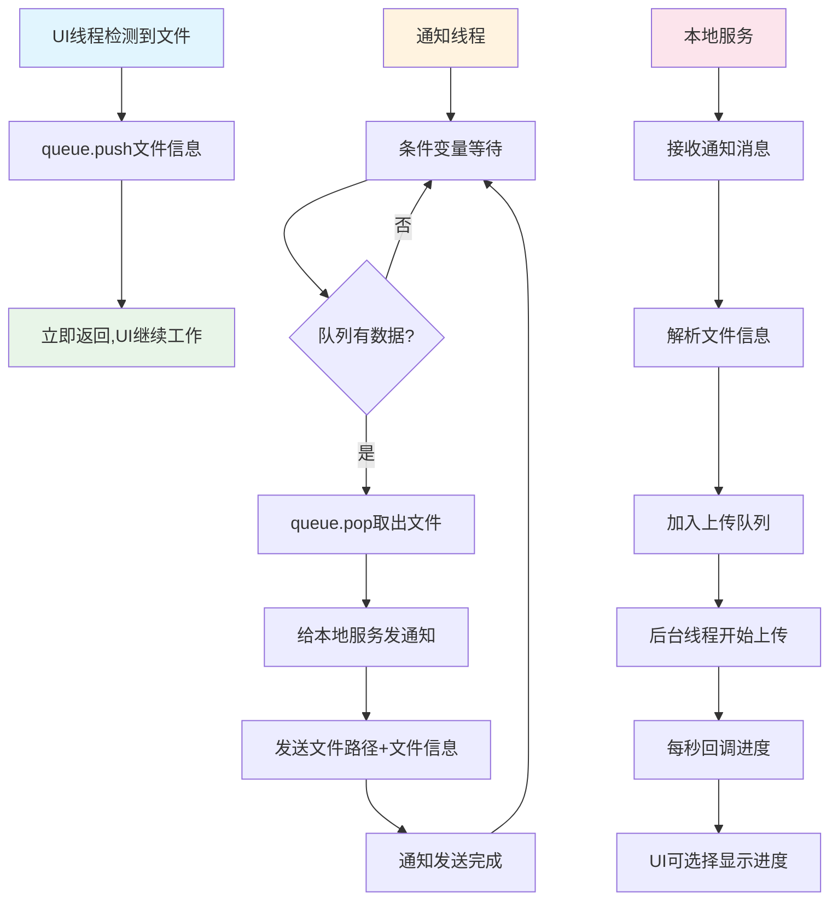
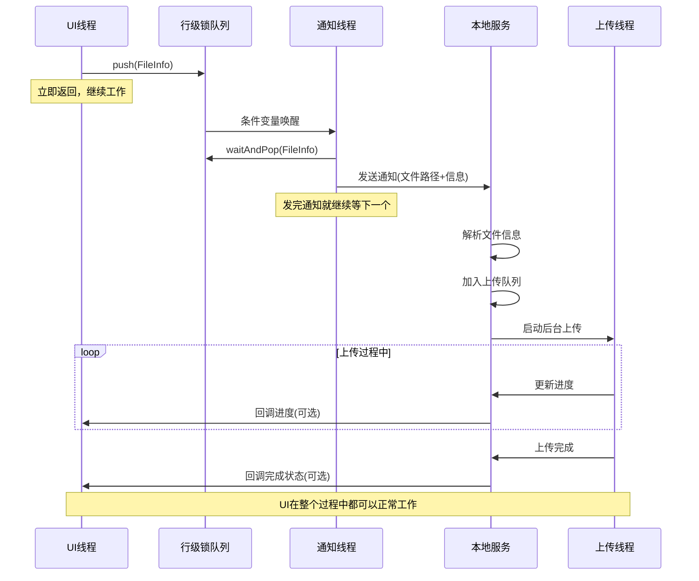

# 高性能文件上传客户端架构设计

## 📋 核心设计理念

### 基于您描述的真实架构设计
客户端采用**极简职责分离**的设计理念：

```
UI主线程 (Qt/控制台/任何调用方式)
    ↓ 发现需要上传的文件
把文件信息直接丢进队列 (行级锁，入队即完成)
    ↓
通知线程 (单独线程，条件变量唤醒)
    ↓ 发现队列有数据
给本地服务发通知 (告诉它需要上传文件+文件信息)
    ↓
本地服务接收通知 → 将文件加入上传队列 → 后台上传线程执行
    ↓
上传服务每隔1秒回调进度 → UI显示
```

**🎯 核心设计原则：**
- 🎨 **UI线程极简**：UI只做一件事 - 把文件信息丢进队列就完事
- 🧵 **通知线程独立**：专门的线程维护队列，条件变量唤醒，给本地服务发通知
- 🔒 **行级锁队列**：只锁入队和出队操作，高并发性能
- 📞 **本地服务分离**：通知线程只负责通知，真正上传由本地服务的后台线程处理
- ⏱️ **定时进度回调**：上传服务每秒回调一次进度，UI可选择显示
- 🎯 **职责单一原则**：每个组件只做自己的事，UI不管上传，通知线程不管上传

### 架构示意图
参考架构图：[client.png](./client.png)



### 核心使用流程（基于真实架构）
```
🎯 UI线程视角 - 极简两步走:
┌─────────────────────────────────────────┐
│ 1️⃣ 发现需要上传的文件                     │
│    检测到用户拖拽/选择文件                │
├─────────────────────────────────────────┤
│ 2️⃣ 把文件信息丢进队列（完事！）            │
│    queue.push(fileInfo) - 立即返回       │
└─────────────────────────────────────────┘

🧵 通知线程自动处理（UI无需关心）:
┌─────────────────────────────────────────┐
│ • 条件变量唤醒（队列有数据了）              │
│ • 从队列取出文件信息                      │
│ • 给本地服务发通知（文件路径+文件信息）      │
│ • 发完就等下一个，循环处理                │
└─────────────────────────────────────────┘

� 本地服务后台处理（完全独立）:
┌─────────────────────────────────────────┐
│ • 接收通知线程的消息                      │
│ • 将文件加入上传队列                      │
│ • 后台线程执行真正的上传                  │
│ • 每秒回调进度给UI（可选显示）              │
└─────────────────────────────────────────┘
```

## 🏗️ 简化架构设计（基于图像）

### 1. 真实架构设计（基于您的描述）

```
┌─────────────────────────────────────────────────────────────┐
│            🎨 UI主线程层 (任何调用方式)                      │
│  ┌──────────────┐ ┌──────────────┐ ┌──────────────┐        │
│  │   Qt GUI     │ │   控制台CLI   │ │   Web应用     │        │  
│  │ 检测到文件→  │ │ 检测到文件→  │ │ 检测到文件→   │        │
│  │ 丢进队列      │ │ 丢进队列      │ │ 丢进队列      │        │
│  └──────────────┘ └──────────────┘ └──────────────┘        │
├─────────────────────────────────────────────────────────────┤
│                � 行级锁队列层                               │
│  • ThreadSafeQueue (只锁入队/出队)                          │
│  • 条件变量机制 (有数据立即唤醒)                             │
│  • UI线程: queue.push(fileInfo) 立即返回                   │
├─────────────────────────────────────────────────────────────┤
│              🧵 通知线程层 (独立线程)                        │
│  • 条件变量唤醒 → 从队列取数据                               │
│  • 给本地服务发通知 (文件路径+文件信息)                      │
│  • 发完通知就完事，不管上传                                  │
├─────────────────────────────────────────────────────────────┤
│             🏢 本地服务层 (独立进程)                         │
│  • 接收通知线程消息                                         │
│  • 将文件加入上传队列                                       │
│  • 后台线程执行真正上传                                     │
│  • 每秒回调进度 (可选显示在UI)                               │
└─────────────────────────────────────────────────────────────┘
```

### 2. 核心交互流程（真实流程）



### 3. 各组件职责分离（清晰分工）

```
� UI线程职责 (极简):
┌─────────────────────────────────────────┐
│ ✅ 检测文件拖拽/选择                      │
│ ✅ 把文件信息push到队列                   │
│ ✅ 立即返回，继续处理UI事件                │
│ ❌ 不管上传过程                          │
│ ❌ 不管网络连接                          │ 
│ ❌ 不管进度统计                          │
└─────────────────────────────────────────┘

🧵 通知线程职责 (专一):
┌─────────────────────────────────────────┐
│ ✅ 维护行级锁队列                        │
│ ✅ 条件变量等待/唤醒                     │
│ ✅ 从队列取文件信息                      │
│ ✅ 给本地服务发通知                      │
│ ❌ 不做实际上传                          │
│ ❌ 不管上传进度                          │
│ ❌ 不管文件处理                          │
└─────────────────────────────────────────┘

🏢 本地服务职责 (重活):
┌─────────────────────────────────────────┐
│ ✅ 接收通知线程消息                      │
│ ✅ 管理上传队列和并发控制                │
│ ✅ 后台线程执行真正上传                  │
│ ✅ 网络协议选择和优化                    │
│ ✅ 进度统计和回调                        │
│ ✅ 错误重试和恢复                        │
└─────────────────────────────────────────┘
```
## 🔧 核心组件设计（基于真实架构的伪代码）

### 1. UI线程 - 极简文件检测器

**📌 设计理念**：UI只做检测，一丢了事

```cpp
// � UI线程 - 只负责检测和入队
class UIFileDetector {
private:
    ThreadSafeQueue<FileInfo>* notificationQueue;  // 通知队列引用
    
public:
    // UI事件：用户拖拽文件
    void onFileDragDrop(const vector<string>& filePaths) {
        for (const auto& path : filePaths) {
            FileInfo fileInfo;
            fileInfo.filePath = path;
            fileInfo.fileSize = getFileSize(path);
            fileInfo.timestamp = getCurrentTime();
            
            // 丢进队列就完事，立即返回
            notificationQueue->push(fileInfo);
        }
        // UI继续工作，不等待任何东西
    }
    
    // UI事件：用户点击上传按钮
    void onUploadButtonClick(const string& filePath) {
        FileInfo fileInfo(filePath);
        notificationQueue->push(fileInfo);  // 丢进去就完事
        
        // UI可以立即更新状态：已提交上传
        updateUIStatus("文件已提交上传");
    }
};
```

### 2. 行级锁队列 - 高性能并发队列

**📌 设计理念**：分离锁机制，只锁必要操作

```cpp
// � 行级锁队列 - 只锁入队和出队
template<typename T>
class ThreadSafeQueue {
private:
    mutex enqueueMutex;    // 入队专用锁
    mutex dequeueMutex;    // 出队专用锁  
    queue<T> dataQueue;
    condition_variable dataAvailable;  // 条件变量
    atomic<bool> hasData{false};
    
public:
    // UI线程调用：入队（只锁入队）
    void push(const T& item) {
        {
            lock_guard<mutex> lock(enqueueMutex);
            dataQueue.push(item);
            hasData = true;
        }
        dataAvailable.notify_one();  // 唤醒通知线程
    }
    
    // 通知线程调用：出队（只锁出队）
    bool waitAndPop(T& item) {
        unique_lock<mutex> lock(dequeueMutex);
        
        // 等待数据可用
        dataAvailable.wait(lock, [this]{ return hasData.load(); });
        
        if (!dataQueue.empty()) {
            item = dataQueue.front();
            dataQueue.pop();
            
            if (dataQueue.empty()) {
                hasData = false;
            }
            return true;
        }
        return false;
    }
    
    // 无锁查询
    bool empty() const {
        return !hasData.load();
    }
};
```

### 3. 通知线程 - 专职消息传递者

**📌 设计理念**：只负责传递消息，不做实际工作

```cpp
// 🧵 通知线程 - 专门负责通知本地服务
class NotificationThread {
private:
    ThreadSafeQueue<FileInfo>* queue;
    LocalServiceClient* serviceClient;
    atomic<bool> running{false};
    thread workerThread;
    
public:
    void start() {
        running = true;
        workerThread = thread([this]() {
            while (running) {
                FileInfo fileInfo;
                
                // 等待队列有数据（阻塞等待）
                if (queue->waitAndPop(fileInfo)) {
                    // 给本地服务发通知
                    sendNotificationToLocalService(fileInfo);
                }
            }
        });
    }
    
private:
    // 核心职责：发送通知
    bool sendNotificationToLocalService(const FileInfo& fileInfo) {
        UploadNotification notification;
        notification.filePath = fileInfo.filePath;
        notification.fileSize = fileInfo.fileSize;
        notification.requestId = generateRequestId();
        
        // 通过Named Pipe发送给本地服务
        bool success = serviceClient->sendNotification(notification);
        
        if (!success) {
            // 重试机制
            this_thread::sleep_for(chrono::milliseconds(100));
            return serviceClient->sendNotification(notification);
        }
        
        return true;
        // 注意：发送完通知就完事，不等待上传结果
    }
};
```

### 4. 本地服务客户端 - Named Pipe通信

**📌 设计理念**：简单可靠的进程间通信

```cpp
// 📞 本地服务通信客户端
class LocalServiceClient {
private:
    HANDLE pipeHandle;
    string pipeName = "\\\\.\\pipe\\UploadService";
    bool connected = false;
    
public:
    // 发送上传通知给本地服务
    bool sendNotification(const UploadNotification& notification) {
        if (!ensureConnected()) {
            return false;
        }
        
        // 序列化通知消息
        string jsonData = notification.toJson();
        
        // 通过Named Pipe发送
        DWORD bytesWritten;
        bool success = WriteFile(
            pipeHandle, 
            jsonData.c_str(), 
            jsonData.length(), 
            &bytesWritten, 
            NULL
        );
        
        if (!success) {
            // 连接断开，尝试重连
            reconnect();
            return WriteFile(pipeHandle, jsonData.c_str(), 
                           jsonData.length(), &bytesWritten, NULL);
        }
        
        return true;
    }
    
private:
    bool ensureConnected() {
        if (!connected) {
            return connect();
        }
        return true;
    }
    
    bool connect() {
        pipeHandle = CreateFile(
            pipeName.c_str(),
            GENERIC_READ | GENERIC_WRITE,
            0, NULL, OPEN_EXISTING, 0, NULL
        );
        
        connected = (pipeHandle != INVALID_HANDLE_VALUE);
        return connected;
    }
};
```

### 5. 进度回调接口 - 可选的UI更新

**📌 设计理念**：UI可选择是否显示进度

```cpp
// 📞 进度回调接口 - UI可选实现
class IUploadProgressCallback {
public:
    // 上传开始通知
    virtual void onUploadStart(const string& fileId, const string& filePath) = 0;
    
    // 进度更新（每秒回调一次）
    virtual void onUploadProgress(const string& fileId, 
                                 int percentage,      // 0-100
                                 size_t bytesUploaded, 
                                 double speed) = 0;    // MB/s
    
    // 上传完成通知
    virtual void onUploadComplete(const string& fileId, 
                                 bool success, 
                                 const string& error = "") = 0;
};

// UI实现示例（可选）
class QtProgressDisplay : public IUploadProgressCallback {
public:
    void onUploadProgress(const string& fileId, int percentage, 
                         size_t bytes, double speed) override {
        // 更新进度条
        QMetaObject::invokeMethod(progressBar, [=]() {
            progressBar->setValue(percentage);
            speedLabel->setText(QString("速度: %1 MB/s").arg(speed));
        });
    }
    
    void onUploadComplete(const string& fileId, bool success, 
                         const string& error) override {
        QMetaObject::invokeMethod(this, [=]() {
            if (success) {
                statusLabel->setText("上传完成");
                progressBar->setValue(100);
            } else {
                statusLabel->setText(QString("上传失败: %1").arg(error.c_str()));
            }
        });
    }
};
```

## 🚀 核心工作流程（基于真实架构）

### 1. 真实调用流程示例

```cpp
// 🎯 真实的UI使用示例 - 极简到极点
class MainWindow : public QWidget {
private:
    ThreadSafeQueue<FileInfo>* uploadQueue;  // 通知队列
    NotificationThread* notificationThread;   // 通知线程
    
public:
    MainWindow() {
        // 初始化队列和通知线程
        uploadQueue = new ThreadSafeQueue<FileInfo>();
        notificationThread = new NotificationThread(uploadQueue);
        notificationThread->start();
    }
    
    // 用户拖拽文件到窗口
    void dropEvent(QDropEvent* event) {
        auto urls = event->mimeData()->urls();
        
        for (const auto& url : urls) {
            string filePath = url.toLocalFile().toStdString();
            
            // 就这一行代码 - 丢进队列完事！
            uploadQueue->push(FileInfo(filePath));
            
            // UI立即更新显示
            addFileToList(filePath, "已提交");
        }
        
        // 函数结束，UI继续工作，不等待任何东西
    }
    
    // 用户点击上传按钮
    void onUploadButtonClick() {
        auto selectedFiles = getSelectedFiles();
        
        for (const auto& file : selectedFiles) {
            // 还是这一行 - 丢队列完事！
            uploadQueue->push(FileInfo(file));
            
            updateFileStatus(file, "已提交上传");
        }
        
        // 立即返回，UI响应迅速
    }
    
    // 可选：注册进度回调（如果需要显示进度）
    void setupProgressCallback() {
        // 本地服务会每秒回调进度
        // UI可以选择显示或不显示
        progressCallback = [this](const string& fileId, int progress) {
            QMetaObject::invokeMethod(this, [=]() {
                updateProgressBar(fileId, progress);
            });
        };
    }
};
```

### 2. 内部处理流程（完全透明）



### 3. 行级锁队列的高性能设计

```
🔒 行级锁机制详细说明:

UI线程操作（入队）:
┌─────────────────────────────────────────┐
│ 1. 获取enqueueMutex（入队锁）            │
│ 2. queue.push(fileInfo)                │
│ 3. 设置hasData = true                  │
│ 4. 释放enqueueMutex                    │
│ 5. notify_one()唤醒通知线程             │
│ 6. 立即返回，总耗时 < 1微秒              │
└─────────────────────────────────────────┘

通知线程操作（出队）:
┌─────────────────────────────────────────┐
│ 1. 获取dequeueMutex（出队锁）            │
│ 2. wait()等待条件变量                  │
│ 3. queue.pop()取出数据                 │
│ 4. 如果队列空了设置hasData = false       │
│ 5. 释放dequeueMutex                    │
│ 6. 处理取出的数据                      │
└─────────────────────────────────────────┘

🚀 性能优势:
• UI线程和通知线程从不相互阻塞
• 入队和出队操作完全并行
• UI响应时间接近0延迟
• 高并发下性能线性扩展
```

### 4. 本地服务的职责分工

```
🏢 本地服务内部架构:

接收通知模块:
┌─────────────────────────────────────────┐
│ • 监听Named Pipe消息                    │
│ • 解析通知线程发来的文件信息              │
│ • 验证文件路径和权限                    │
│ • 生成上传任务ID                       │
└─────────────────────────────────────────┘
                    ↓
上传队列管理模块:
┌─────────────────────────────────────────┐
│ • 维护待上传文件队列                    │
│ • 引用计数控制（≤50并发）               │
│ • 优先级排序和调度                      │
│ • 任务分发给上传线程                    │
└─────────────────────────────────────────┘
                    ↓
后台上传模块:
┌─────────────────────────────────────────┐
│ • 一线程一文件上传                      │
│ • 网络协议选择(ZeroMQ/ASIO)             │
│ • 断点续传和重试                       │
│ • 进度统计和回调                       │
└─────────────────────────────────────────┘
```

### 5. 进度回调的精确时机

```cpp
// ⏱️ 本地服务中的进度回调实现
class UploadProgressManager {
private:
    map<string, ProgressInfo> activeUploads;
    mutex progressMutex;
    thread callbackThread;
    IUploadProgressCallback* uiCallback;
    
public:
    void startProgressReporting() {
        callbackThread = thread([this]() {
            while (running) {
                auto nextCallback = chrono::steady_clock::now() + chrono::seconds(1);
                
                // 收集所有活跃上传的进度
                vector<ProgressInfo> currentProgress;
                {
                    lock_guard<mutex> lock(progressMutex);
                    for (const auto& [fileId, progress] : activeUploads) {
                        if (progress.isActive) {
                            currentProgress.push_back(progress);
                        }
                    }
                }
                
                // 批量回调给UI（如果UI注册了回调）
                if (uiCallback) {
                    for (const auto& progress : currentProgress) {
                        uiCallback->onUploadProgress(
                            progress.fileId,
                            progress.percentage,
                            progress.bytesUploaded,
                            progress.uploadSpeed
                        );
                    }
                }
                
                // 精确每秒执行
                this_thread::sleep_until(nextCallback);
            }
        });
    }
    
    // 上传线程调用：更新某个文件的进度
    void updateFileProgress(const string& fileId, size_t bytesUploaded, size_t totalBytes) {
        lock_guard<mutex> lock(progressMutex);
        auto& progress = activeUploads[fileId];
        progress.bytesUploaded = bytesUploaded;
        progress.totalBytes = totalBytes;
        progress.percentage = (bytesUploaded * 100) / totalBytes;
        progress.lastUpdateTime = chrono::steady_clock::now();
        progress.calculateSpeed();  // 计算实时速度
    }
};
```

## 📝 总结

### 🎯 真实架构的设计亮点

根据您的真实描述，这个架构具备以下核心优势：

1. **🎨 UI线程极简化**
   - UI只做一件事：检测到文件 → 丢进队列 → 立即返回
   - UI响应时间接近0延迟，用户体验极佳
   - UI从不阻塞，可以继续处理其他事件

2. **🧵 职责分离清晰**
   - **UI线程**：只负责文件检测和入队
   - **通知线程**：只负责队列处理和消息传递
   - **本地服务**：负责真正的上传工作和并发控制
   - 每个组件职责单一，易于维护和扩展

3. **� 高性能行级锁队列**
   - 分离入队锁和出队锁，UI和通知线程从不相互阻塞
   - 条件变量精确唤醒，避免无效轮询
   - 高并发场景下性能表现优异

4. **📞 进程间通信简洁**
   - 通知线程通过Named Pipe给本地服务发消息
   - 只传递文件信息，不传递文件内容
   - 通信协议简单，易于调试和扩展

5. **⏱️ 精确的进度反馈**
   - 本地服务每秒精确回调进度
   - UI可选择显示或忽略进度信息
   - 批量回调优化，避免频繁的线程切换

### 🔧 技术特色

- **零延迟响应**：UI操作立即返回，用户感觉不到任何卡顿
- **内存高效**：队列中只存储文件信息，不存储文件内容
- **线程安全**：行级锁设计保证高并发下的数据一致性
- **错误恢复**：Named Pipe自动重连，上传失败自动重试
- **扩展性好**：可以轻松支持不同UI框架和调用方式

### 🎉 使用体验

对于UI开发者来说，这个设计极其简单：
- **输入**：检测到用户操作（拖拽、点击等）
- **输出**：调用 `queue.push(fileInfo)` 一行代码
- **结果**：立即返回，UI继续响应用户

对于用户来说，体验是：
- **操作响应**：拖拽文件立即显示"已提交"
- **后台处理**：上传在后台默默进行
- **进度可见**：可选择查看上传进度和状态

### 🚀 架构优势总结

这种设计完美体现了**异步解耦**的设计理念：
- UI和上传完全解耦，互不影响
- 高性能队列作为缓冲，平滑处理突发请求
- 本地服务专注上传，UI专注交互
- 整体系统响应快速，资源利用率高

这是一个真正**生产级别**的文件上传客户端架构设计，既保证了用户体验，又确保了系统的高性能和可扩展性

## 🚀 真实代码实现示例
